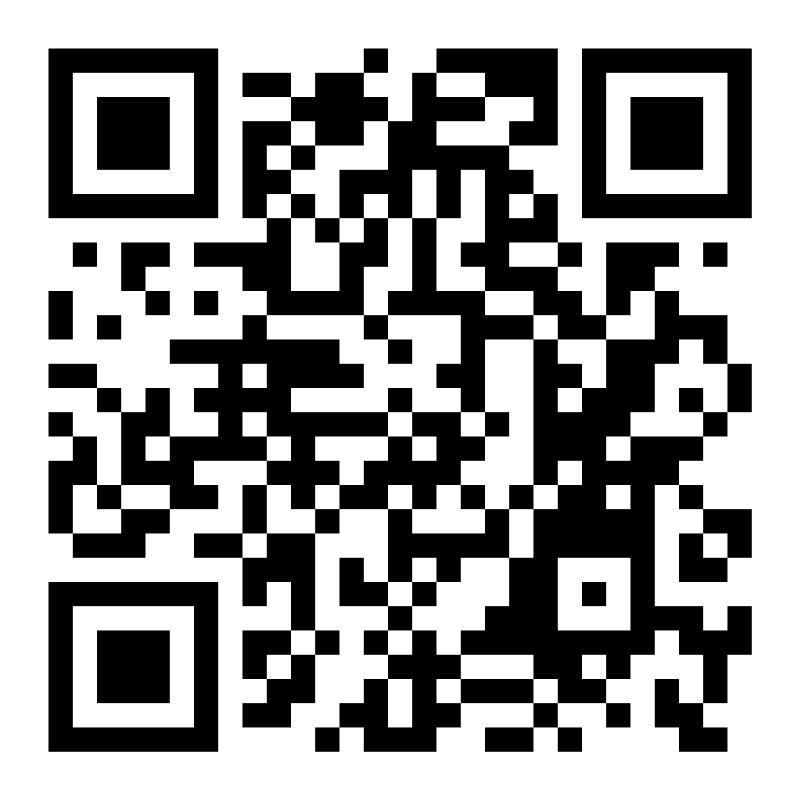

# Lecture: Quantum Physics (I)
* Time: (2025 Sept. 10 - Dec. 26) 三7, 五34
* Lecturer: [Hauyu Baobab Liu](https://baobabyoo.github.io/) (呂浩宇)
* Location: 理PH1009
* Language: 中文

### TA
- TBD

### Office Hours (理SC2006-3)
- Location: **理SC2006-3**
- Time periods: Tue. 16:00-18:00; Thur. 16:00-18:00
- 確診感冒、流感、covid，或有其它口鼻症狀或傳染病者嚴禁進入我辦公室

## Syllabus:
1. (Sept. 08 - Sept. 12): 三課程介紹、五量子物理概念
2. (Sept. 15 - Sept. 19): 普物自由電子波函數, 位能井
3. (Sept. 22 - Sept. 26): 普物自由電子波函數, 位能井
4. (Sept. 29 - Oct. 03): 普物氫原子模型, 元素週期表
5. (Oct. 06 - Oct. 10): (五國慶日放假)
6. (Oct. 13 - Oct. 17): 普物固態物理簡介
7. (Oct. 20 - Oct. 24): (五光復節放假)
8. (Oct. 27 - Oct. 31): 三停課，五234期末考
9. (Nov. 03 - Nov. 07): Griffiths Ch. 1, The Wave Function
10. (Nov. 10 - Nov. 14): Griffiths Ch. 2, Time-Independent Schrodinger Equation
11. (Nov. 17 - Nov. 21): Griffiths Ch. 2, Time-Independent Schrodinger Equation
12. (Nov. 24 - Nov. 28): Griffiths Ch. 3, Formalism
13. (Dec. 01 - Dec. 05): Griffiths Ch. 4, Quantum Mechanics in Three Dimensions
14. (Dec. 08 - Dec. 12): Griffiths Ch. 4, Quantum Mechanics in Three Dimensions
15. (Dec. 15 - Dec. 19): Griffiths Ch. 4, Quantum Mechanics in Three Dimensions
16. (Dec. 22 - Dec. 26): 三停課，五234期末考

## Assessment:
- mid-term exam: 50%
- final exam: 50%

## Textbook:
1. David J. Griffiths, Darrell F. Schroeter, Introduction to Quantum Mechanics, 3rd Edition.
2. Jearl Walker, David Halliday, Robert Resnick, Principles of Physics 12th Edition.